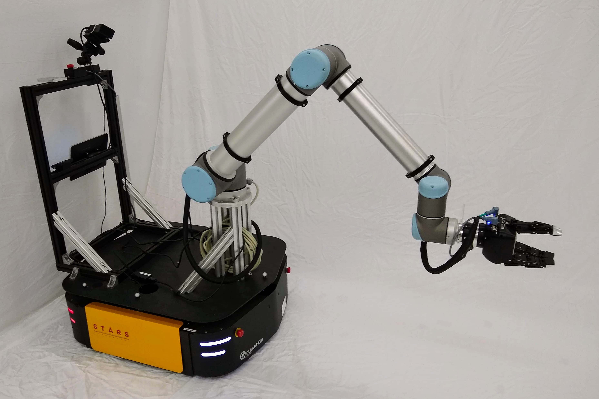

# Mobile Manipulator Shared Code

This repository contains shared code for running experiments with the "Thing"
mobile manipulator (shown below). It should work on Ubuntu 18.04, but 20.04
is preferred.



## System Information

### Hardware

The robot consists of a UR10 manipulator mounted on a Ridgeback omnidirectional
mobile base. The base has a Hokuyo UST-10LX laser range finder mounted at the
front that provides a two-dimensional scan in a 270 degree arc in front of the
robot. The end effector has a Robotiq FT 300 force torque sensor mounted at the
wrist to measure the applied wrench, as well as Robotiq 3 finger gripper for
manipulation.

### Software

The Ridgeback is currently running Ubuntu 20.04 on its onboard computer. The
UR10 is running firmware version 3.15.

## Documentation

Manuals and datasheets, as well as other documents, can be found in the `docs`
directory.

## Installation and Setup

Ensure ROS is installed. Install dependencies:
```
sudo apt install libeigen3-dev ros-noetic-eigenpy ros-noetic-hpp-fcl ros-noetic-pinocchio
```
Ensure that you also modify `$PYTHONPATH` to include the location of
Pinocchio's Python bindings. Typically, this would be something like
```
/opt/ros/noetic/lib/python3.8/site-packages
```

Clone this repository into the catkin workspace:
```
cd catkin_ws/src
git clone https://github.com/utiasDSL/mobile_manipulation_central mobile_manipulation_central
```

Install Python dependencies:
```
python3 -m pip install -r requirements.txt
```

Build the workspace:
```
catkin build
```

### Real Hardware Setup

For working with real hardware, install the following packages into the catkin
workspace:
* [ur_robot_driver](https://github.com/UniversalRobots/Universal_Robots_ROS_Driver) - for the UR10 arm.
* [robotiq](https://github.com/TAMS-Group/robotiq) - for the Robotiq 3F gripper. This is a fork of the original (now unmaintained) repo.
* [vicon_bridge](https://github.com/ethz-asl/vicon_bridge) - required to track
  the position of the mobile base. May also be useful to track other objects,
  calibrate the EE pose, etc.

The ROS master node runs onboard the Ridgeback computer and is started
automatically when the Ridgeback is turned on. You need to tell your laptop
where to reach the ROS master. First, add to `/etc/hosts`:
```
192.168.131.1 cpr-tor11-01
```
Then, in each terminal where you want to connect to the robot over ROS, run
```
export ROS_IP=192.168.131.100
export ROS_MASTER_URI=http://cpr-tor11-01:11311
```
To revert back to default settings (so you can run ROS locally, for example),
do:
```
export ROS_MASTER_URI=http://localhost:11311
unset ROS_IP
unset ROS_HOSTNAME
```
It is convenient to put the above functions in a script that can be easily
sourced (I like to use [this tool](https://github.com/adamheins/s)).

Connect to the robot via ethernet and set up a new Wired Connection named
`Thing`. In the `IPv4 Settings` tab, switch to method `Manual` and enter an
address of `192.168.131.100` with netmask `255.255.255.0`. Leave the gateway
blank. Once done, you should be able to ping the robot at `192.168.131.1`.

## Usage

One of the main goals of this repo is to facilitate easy development over ROS.
We provide ROS interfaces for the base, arm, and combined mobile manipulator
system (`src/mobile_manipulation_central/ros_interface.py`) which provide a
standard API to communicate with the robot over ROS. Theses interfaces can be
used seamlessly with real hardware or a simulated version of the robot
(`src/mobile_manipulation_central/simulation_ros_interface.py`).

### Simulation

This repo provides a basic simulation environment based on
[PyBullet](https://pybullet.org), a demo of which can be found in
`scripts/simulation/pyb_simulation.py`.

### Kinematics

Kinematics based on [Pinocchio](https://github.com/stack-of-tasks/pinocchio) is
provided in both C++ and Python. An example of the kinematics in C++ can be
found in `src/kinematics_example.cpp`

### Real Hardware

Some scripts expect the environment variable
`MOBILE_MANIPULATION_CENTRAL_BAG_DIR` to point to the directory where bags are
stored (to create or read bag files). Export this variable in your `.bashrc`.

Vicon is used to track the base position as well as any other objects in the
scene. You must be connected to the `DSL_DroneNet_5G` network.

Start the Vicon bridge, UR10 driver, and gripper driver:
```
roslaunch mobile_manipulation_central thing.launch
```
To stream commands to the UR10, you must start the onboard program.

Interaction with the robot is primarily done using the feedback topics (of type
`sensor_msgs/JointState`):
```
/ridgeback/joint_states
/ur10/joint_states
```
and the velocity command topics
```
/ridgeback/cmd_vel  # geometry_msgs/Twist
/ur10/cmd_vel       # std_msgs/Float64MultiArray
```
For Python nodes this is abstracted away using the interfaces in
`src/mobile_manipulation_central/ros_interface.py`.

#### Scripts

There are some convenient scripts in the `scripts` directory:

* `control/home.py` sends the robot to a particular home configuration, which is taken
  from `home.yaml`.
* `control/gripper.py` opens and closes the gripper.
* `control/sine_trajectory` tracks a sinusoidal trajectory with a single joint.

## Tests

Unit tests can be found in the `test` directory. Currently there are only
Python unit tests, which can be run using [pytest](https://pytest.org/).

## Robot specifications

### Ridgeback limits

With reference to [this
file](https://github.com/ridgeback/ridgeback/blob/melodic-devel/ridgeback_control/config/control.yaml),
the limits are:

| Joint | Velocity  | Acceleration |
| ----- | --------- | ------------ |
| x     | 1.1 m/s   | 2.5 m/s²     |
| y     | 1.1 m/s   | 2.5 m/s²     |
| yaw   | 2.0 rad/s | 1.0 rad/s²   |

These values can be confirmed on the real system by checking the parameters
using `rosparam get /ridgeback_velocity_controller/...`

### UR10 limits
With reference to the UR10 datasheet as well as the onboard UR10 configuration
files (for acceleration), the joint limits are:

| Joint | Position (rad) | Velocity (rad/s)  | Acceleration (rad/s²)  |
| ----- | -------------- | ----------------- | ---------------------- |
| 1     | ± 2π           | ± ⅔π              | ± 40                   |
| 2     | ± 2π           | ± ⅔π              | ± 40                   |
| 3     | ± 2π           | ± π               | ± 40                   |
| 4     | ± 2π           | ± π               | ± 40                   |
| 5     | ± 2π           | ± π               | ± 40                   |
| 6     | ± 2π           | ± π               | ± 40                   |

### IP addresses
* Ridgeback: `192.168.131.1`
* UR10: `192.168.131.40`
* Gripper: `192.168.131.18`
* F/T sensor: `192.168.131.14`

### Ridgeback lights
The lights on the corners of the Ridgeback mean different things depending on
the color. The main ones are:

* Green: plugged in (not necessarily charging)
* Flashing red: e-stop
* Front white, back red: ready to drive
* Flashing yellow: battery level is below 24V, charge soon

## Misc notes
* The Ridgeback controller automatically publishes a zero command (i.e. brake)
  to the Ridgeback when a new connection is made; i.e., when something new
  subscribes or publishes to the `cmd_vel` topic. This appears to be due to
  [this line](https://github.com/ridgeback/ridgeback/blob/melodic-devel/ridgeback_control/src/mecanum_drive_controller.cpp#L281).
* Start or stop a particular `ros_control` controller using:
  ```
  rosrun controller_manager controller_manager start <controller_name>
  rosrun controller_manager controller_manager stop <controller_name>
  ```
* The PS4 controller for the Ridgeback can be manually turned off by holding
  the PS button for about 15 seconds (until the blue light turns off).

### Gripper control
* The gripper typically uses real-time ethernet (Modbus TCP) for communication.
  If this fails for some reason, it is also possible to communicate using
  Modbus RTU over a USB connection. This requires the [Robotiq User
  Interface](docs/manuals/robotiq/robotiq-user-interface.pdf) GUI, which only
  runs in Windows.

### Check Ridgeback battery voltage
Ensure you have `diagnostics_msgs` installed (`sudo apt install
ros-noetic-diagnostic-msgs`). Then:
```
rosrun mobile_manipulation_central battery_voltage.py
```
Battery voltage should be between 22V (very low charge) and 27.6V (recently
charged) (see
[here](https://clearpathrobotics.com/blog/2021/12/battery-usage-and-maintenance-tips-for-clearpath-robots/)).
If the voltage is approaching 22V, stop experiments and plug in the robot.

### Ridgeback Packages
* High-level functions: [ridgeback](https://github.com/ridgeback/ridgeback)
* Low-level functions: [ridgeback_robot](https://github.com/ridgeback/ridgeback_robot)
* Motor driver: [puma_motor_driver](https://github.com/clearpathrobotics/puma_motor_driver)

## Known Issues
* ~~It appears that the on-board battery is wearing down. The battery voltage on
  start-up (after charging) is now only about 25V, instead of the nominal full
  charge of 27.6V. It is worth checking this regularly to assess the battery
  health over time.~~ The battery has been replaced; a full charge is now
  approximately 25.6V.
* Occasionally when starting the robot the connection to the UR10 cannot be
  made. The `ur_robot_driver` node (launched as part of `thing.launch`) will
  complain with something along the lines of
  ```
  could not connect to robot at address 192.168.131.40
  ```
  You can test for this explicitly by trying to ping the arm:
  ```
  ping 192.168.131.40
  ```
  which will say that the host in unreachable. This can be fixed by unplugging
  and replugging the ethernet cable between the base and arm *at the arm's
  computer*. Alternatively, one can restart the UR10 until the problem
  goes away (i.e. the connection is established properly). There is no need to
  restart the Ridgeback. It appears that this is a startup issue; the
  connection is generally very stable once established. The ethernet cable
  between the base and arm computers does not seem to be at fault: it was
  replaced and the issue was seen again. It appears there may be an issue with
  arm's startup network logic.
* Similar to the above, it is possible that the connection from the laptop to
  the Ridgeback will also not be available, despite the base (and possibly the
  arm) appearing to be powered on normally. However, this seems to be quite
  rare. Restarting the base eventually resolves the problem. 
* Occasionally after starting the arm, one may get protective stops after every
  small movement of the arm, due to base deviation from desired path. So far,
  it appears that restarting the arm resolved the problem.

## Todo
* Add Kalman filter for Ridgeback base and UR10 joints
